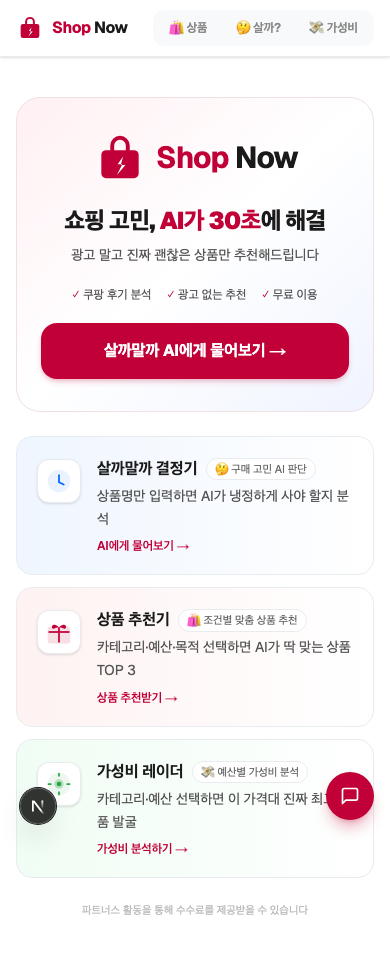
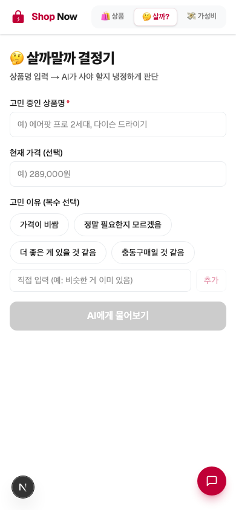
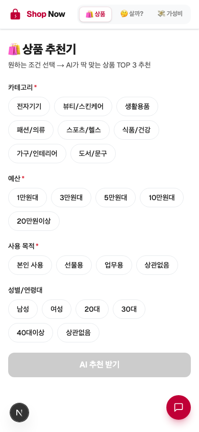
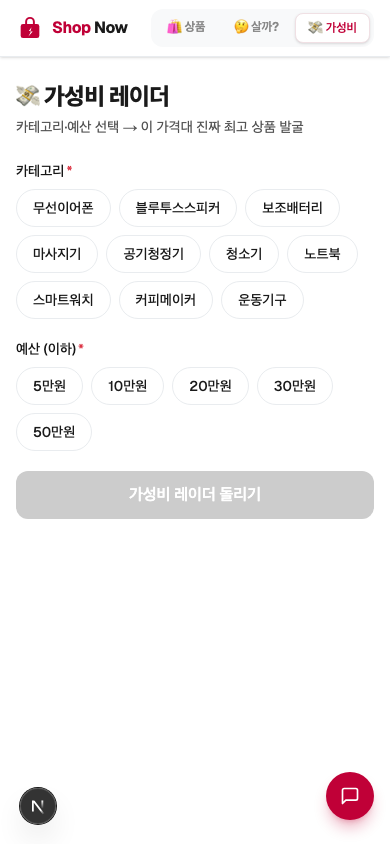

<div align="center">
  

  # Shop Now

  **쇼핑 고민, AI가 30초에 해결**

  광고 없이 진짜 괜찮은 상품만 추천해드립니다

  [](https://shop-now-ebon.vercel.app)
  [](https://nextjs.org)
  [](https://openai.com)

</div>

---

## 화면 미리보기

<table>
  <tr>
    <td align="center"><b>홈</b></td>
    <td align="center"><b>살까말까 결정기</b></td>
  </tr>
  <tr>
    <td></td>
    <td></td>
  </tr>
  <tr>
    <td align="center"><b>상품 추천기</b></td>
    <td align="center"><b>가성비 레이더</b></td>
  </tr>
  <tr>
    <td></td>
    <td></td>
  </tr>
</table>

---

## 주요 기능

| 기능 | 설명 |
|------|------|
| 🤔 **살까말까 결정기** | 상품명만 입력하면 AI가 구매 추천도(0~100점)와 사야/참아야 이유를 냉정하게 분석 |
| 🎁 **상품 추천기** | 카테고리·예산·목적을 선택하면 AI가 딱 맞는 상품 TOP 3를 실시간 가격과 함께 추천 |
| 💸 **가성비 레이더** | 예산을 선택하면 최고·무난·프리미엄 3종의 가성비 상품을 발굴 |
| 🔗 **쿠팡 실시간 가격** | 쿠팡 Partners API로 실시간 가격·이미지·평점 조회 및 파트너스 트래킹 딥링크 생성 |
| 📤 **결과 공유** | 판정 결과를 URL·카카오톡으로 공유, 동적 OG 이미지 자동 생성 |
| 🏅 **배지 시스템** | 이용 횟수에 따라 5종 배지 획득, 판정 히스토리 기록 |

---

## 기술 스택

- **Framework:** Next.js 16.2.7 (App Router, Turbopack)
- **UI:** Tailwind CSS v4
- **AI:** OpenAI SDK v6 (`gpt-4o-mini`, 서버 사이드)
- **쇼핑:** 쿠팡 Partners API (HMAC-SHA256, 실시간 검색 + deeplink)
- **Rate Limiting:** Upstash Redis (IP 기반 슬라이딩 윈도우, 분당 10회)
- **Analytics:** Vercel Analytics
- **Deploy:** Vercel

---

## 로컬 실행

```bash
git clone <repo-url>
cd shop-now
cp .env.sample .env.local   # 환경변수 설정
npm install
npm run dev                  # http://localhost:3000
```

### 필요한 환경변수

| 변수 | 설명 |
|------|------|
| `OPENAI_API_KEY` | OpenAI API 키 |
| `NEXT_PUBLIC_KAKAO_APP_KEY` | 카카오 JS 앱 키 |
| `COUPANG_ACCESS_KEY` | 쿠팡 Partners API Access Key |
| `COUPANG_SECRET_KEY` | 쿠팡 Partners API Secret Key |
| `NEXT_PUBLIC_COUPANG_PARTNER_ID` | 쿠팡 파트너 ID |
| `NEXT_PUBLIC_BASE_URL` | 배포 도메인 |
| `KV_REST_API_URL` | Upstash Redis REST URL |
| `KV_REST_API_TOKEN` | Upstash Redis REST Token |

### 주요 명령어

```bash
npm run lint      # ESLint 검사
npm run format    # Prettier 적용
npm run deploy    # Vercel 프로덕션 배포
```

---

## 프로젝트 구조

```
app/
  page.tsx              — 홈 (Hero + 기능 카드 3개)
  decide/page.tsx       — 살까말까 결정기
  gift/page.tsx         — 상품 추천기
  budget/page.tsx       — 가성비 레이더
  result/page.tsx       — 공유 랜딩
  api/
    recommend/          — OpenAI + 쿠팡 API 통합 엔드포인트
    og/route.tsx        — 동적 OG 이미지 생성

components/             — JudgmentCard, ScoreGauge, CoupangButton 등
lib/                    — OpenAI, 쿠팡 HMAC, Rate Limit, 배지 유틸
```

---

<div align="center">
  <sub>이 서비스는 쿠팡 파트너스 활동의 일환으로, 구매 시 일정 수수료를 제공받을 수 있습니다.</sub>
</div>
